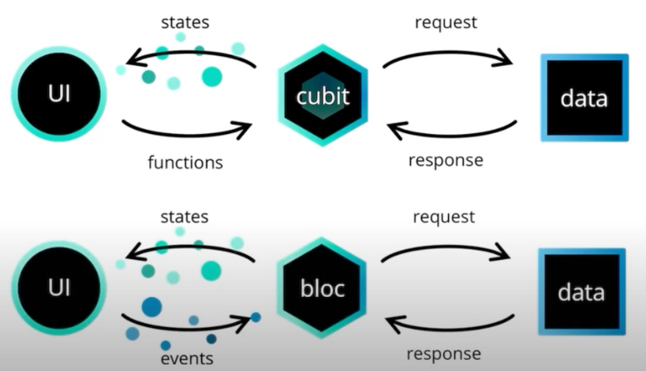

# flutter_bloc implementation notes

## Env.

Flutter SDK 2.5.1
Dart 2.1.4

## Pkg.

flutter_bloc 7.3.2

## Bloc & Cubit


* image from WCKD's flutterly channel

- Bloc & Cubit as a logic component to handle the business logic and communicate with both UI and data model
- From Bloc/Cubit to UI, **streams were used to send states asynchronously**
- From UI to Bloc, it's **driven by events** which are also by stream
- From UI to Cubit, it's **driven by functions** which defined in Cubit
- Concepts: Start from Cubit, then based on the requirement, convert it to Bloc optionally

## Class Structure (Cubit)

```
class MyCubit extends Cubit<MyCubitState> {
    // A property named `state` is generated automatically
    // We can use MyCubit().state to touch the state value
    // An initial state object will be provided to super in the constructor
    MyCubit(): Super( `Initial state` );

    // Define necessary functions for UI to response user action
    void toggleSwitch() => emit(MyCubitState(value: `new state value`));
    void tapSubmitButton() => emit(MyCubitState(value: `another state value`));
}

Class MyCubitState {
    final String value

    MyCubitState({required this.value});
}
```

## UI Builder

1. Use single Bloc/Cubit in widget tree

```
void build(BuildContext context) {
    return BlocProvider<MyCubit> {
        create: (Context) => MyCubit(),
        child: Container(),
    };
}
```

2. Use multiple Bloc/Cubit in widget tree

```
void build(BuildContext context) {
    return MultiBlocProvider(
        providers: [
            BlocProvider<ACubit>(
                create: (context) => ACubit();
            ),
            BlocProvider<BCubit>(
                create: (context) => BCubit();
            ),
        ],
        child: Container();
    );
}
```

3. Render widget based on Bloc/Cubit
   A. BlocBuilder  
   **buildWhen:** Used to set a condition to trigger rebuilding when a state was streamed in.  
   **builder:** The widget builder with state a parameter.  

   ```
   BlocBuilder<MyCubit, MyCubitState>(
       buildWhen: (previousState, currentState) {
           return previousState != currentState
       },
       builder: (context, state) {
           return Container()
       }
   );
   ```

   B. Context.watch()
   Will find corresponded Bloc/Cubit then keep listening to it, and trigger rebuilding everytime when there is new state comming.
   This is suitable to use if we need multiple Bloc/Cubit at the same time.

   ```
   Builder(
       builder: (context) {
           final aCubitState = context.watch<ACubit>().state;
           final bCubitState = context.watch<BCubit>().state;
           return MyWidget(aCubitState, bCubitState);
       }
   );
   ```

4. Get Bloc/Cubit inside widget tree
   ** When getting Bloc/Cubit inside widget tree, it will start from provided context, and **look up\*\* through the ancestor context until it found it

```
void build(BuildContext context) {
    final myCubit = BlocProvider.of<MyCubit>(context)
}
```

## Tutorial video by WCKD
https://www.youtube.com/watch?v=THCkkQ-V1-8
